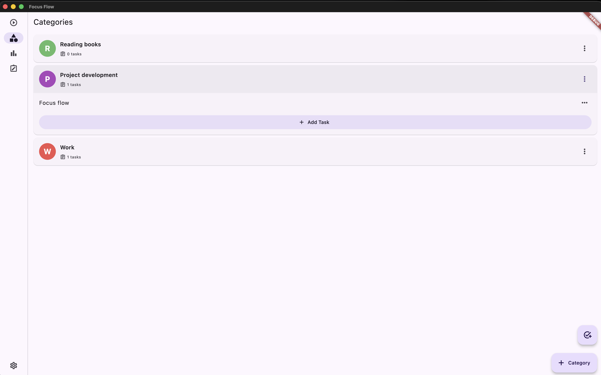
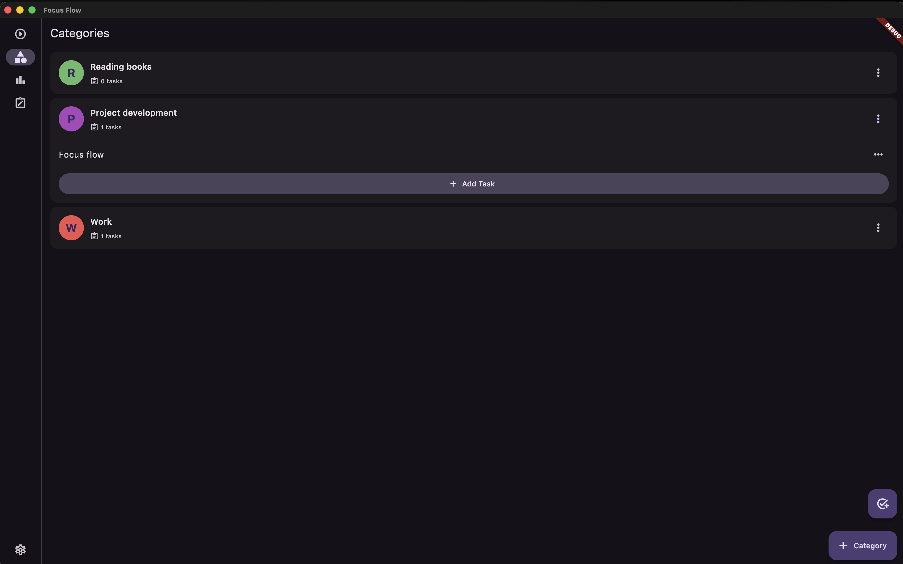
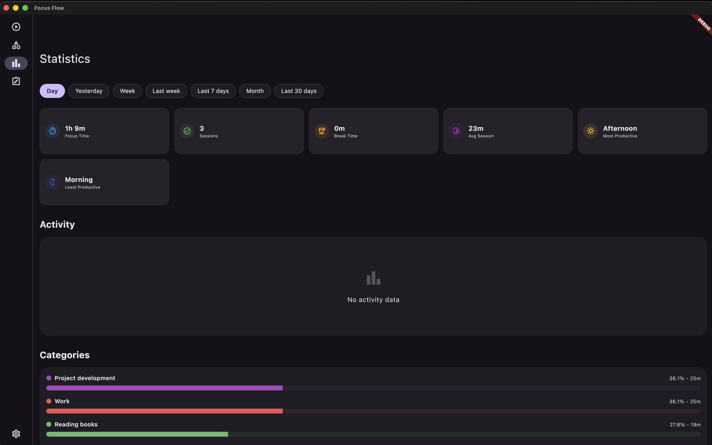
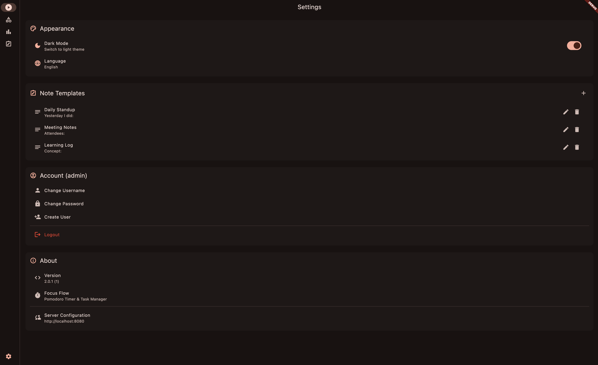

# FocusFlow Cloud & App

[](LICENSE)
[](https://github.com/francesco-gaglione/focus_flow_cloud/actions)
[](https://github.com/francesco-gaglione/focus_flow_cloud/actions)
[](https://francesco-gaglione.github.io/focus_flow_cloud/)

A comprehensive Pomodoro technique tracking solution featuring a Rust backend and a Flutter mobile application. This monorepo contains both the cloud infrastructure and the client application.

> 📚 **Full Documentation**: [https://francesco-gaglione.github.io/focus_flow_cloud/](https://francesco-gaglione.github.io/focus_flow_cloud/)

## 📸 Demo

<table align="center">
  <tr>
    <td align="center" width="25%"><b>Focus Session</b></td>
    <td align="center" width="25%"><b>Task Management</b></td>
    <td align="center" width="25%"><b>Statistics</b></td>
    <td align="center" width="25%"><b>Settings</b></td>
  </tr>
  <tr>
    <td></td>
    <td></td>
    <td></td>
    <td></td>
  </tr>
  <tr>
    <td></td>
    <td></td>
    <td></td>
    <td></td>
  </tr>
</table>

## 🎯 What is FocusFlow?

FocusFlow is a complete ecosystem for time management using the Pomodoro technique. It allows you to:

- **Track Sessions**: Manage work and break intervals.
- **Sync in Real-time**: Synchronize state across multiple devices using WebSockets.
- **Organize Tasks**: Categorize and color-code your to-dos.
- **Analyze Productivity**: View detailed statistics and patterns.

I built this project for my personal use to optimize my daily workflow and decided to share it as an open-source project.

## 📂 Project Structure

This is a monorepo containing:

- **[`backend/`](backend/)**: The server-side application built with Rust (Axum, Diesel, Tokio).
- **[`app/`](app/)**: The client-side mobile application built with Flutter (Bloc, Dio, GoRouter).

## 🚀 Features

### Backend

- **Pomodoro Session Tracking**: Core logic for timer state.
- **Real-time Synchronization**: WebSocket broadcasting to all connected clients.
- **RESTful API**: Documented via OpenAPI/Swagger.
- **Clean Architecture**: Domain-driven design.

### App

- **Timer UI**: Clean, responsive interface for managing sessions.
- **Task Management**: Create and organize tasks with categories.
- **Statistics**: Visual insights into your productivity.
- **Multi-platform**: Runs on iOS, Android, and Web.

## 🛠️ Getting Started

### 🐳 Self-Hosting with Docker

The easiest way to run FocusFlow is using Docker Compose.

PLEASE READ THE [FULL DOCUMENTATION](doc/docs/getting-started.md) for detailed setup instructions.

**Quick Example (`docker-compose.yml`):**

```yaml
services:
  backend:
    image: ghcr.io/francesco-gaglione/focusflowcloud:latest
    environment:
      - DATABASE_BASE_URL=db:5432
      - POSTGRES_USER=focusflow
      - POSTGRES_PASSWORD=secure_pw
      - POSTGRES_DB=focusflow
      - JWT_SECRET=change_me
      - CORS_ORIGIN=*
    ports: ["8080:8080"]
    depends_on: [db]
  db:
    image: postgres:15-alpine
    environment:
      - POSTGRES_USER=focusflow
      - POSTGRES_PASSWORD=secure_pw
      - POSTGRES_DB=focusflow
```

### 💻 Development Setup

We use [`just`](https://github.com/casey/just) to manage commands for the entire repository.

**Prerequisites**: Rust 1.70+, Flutter 3.7.0+, Docker.

**Quick Commands**:

| Command | Description |
| :--- | :--- |
| `just backend-run` | Run the Rust backend locally |
| `just app-run` | Run the Flutter app |
| `just test-all` | Run all tests |

#### 1. Setup Backend (Local)

1.  **Environment**: `backend/.env` is required. See `.env.example`.
2.  **Database**:
    ```bash
    cd backend && docker-compose up -d db
    diesel migration run
    ```
3.  **Run**: `just backend-run`

#### 2. Setup App (Local)

1.  **Install**: `just app-pub-get`
2.  **Run**: `cd app && flutter run`

## 🤝 Contributing

Contributions are welcome! This monorepo allows you to work on the full stack.

- If you change the API, please ensure the Flutter client is updated accordingly.
- Run `just test-all` before submitting a PR.

### Commit Guidelines

We strictly follow **[Conventional Commits](https://www.conventionalcommits.org/)** to manage versioning and changelogs automatically.

**Format:**

```text
<type>(<scope>): <subject>
```

**Common Types:**

- `feat`: A new feature (**Minor** version bump)
- `fix`: A bug fix (**Patch** version bump)
- `docs`, `chore`, `refactor`, `test`: Other changes (no version bump)

> [!IMPORTANT]
> **💥 Breaking Changes**
> If your changes break backward compatibility, you **MUST** indicate it to trigger a **MAJOR** version bump.
>
> You can do this by adding a `!` after the type:
>
> ```text
> feat!: remove legacy API endpoints
> ```

## 📝 License

This project is licensed under the MIT License - see the [LICENSE](LICENSE) file for details.
