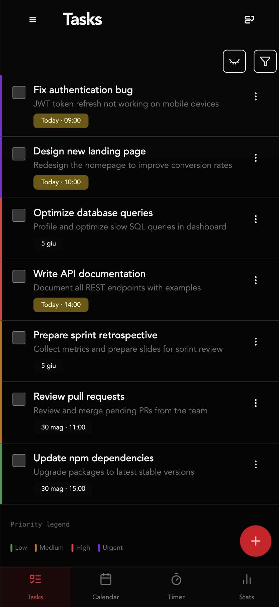
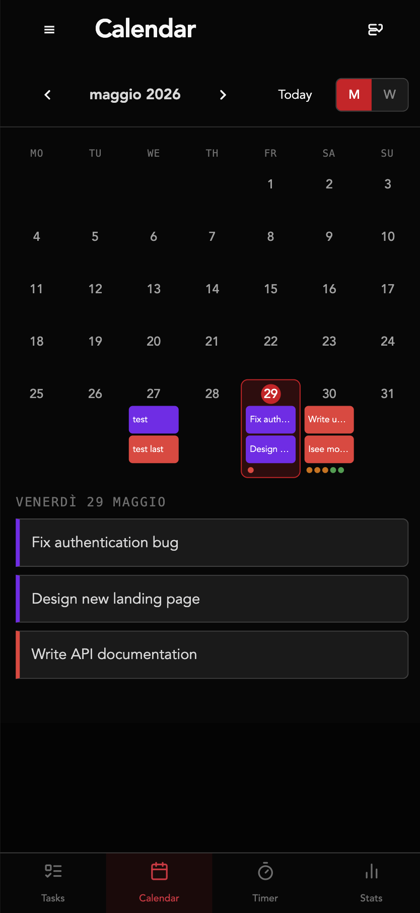
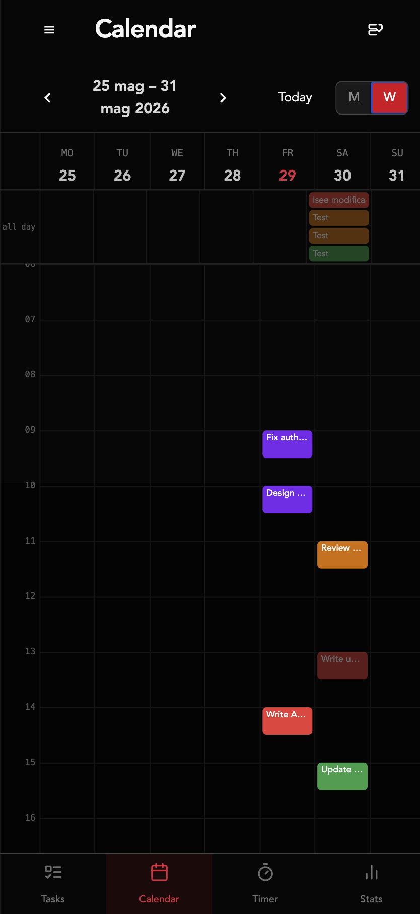
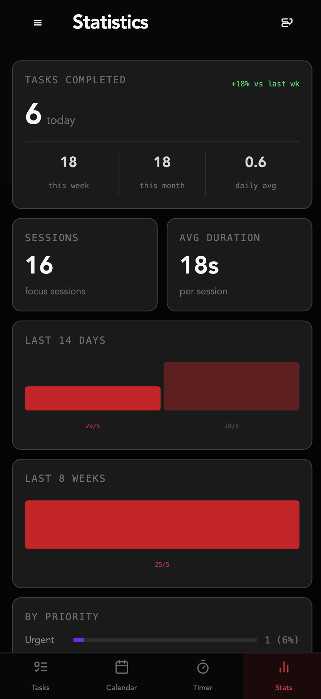
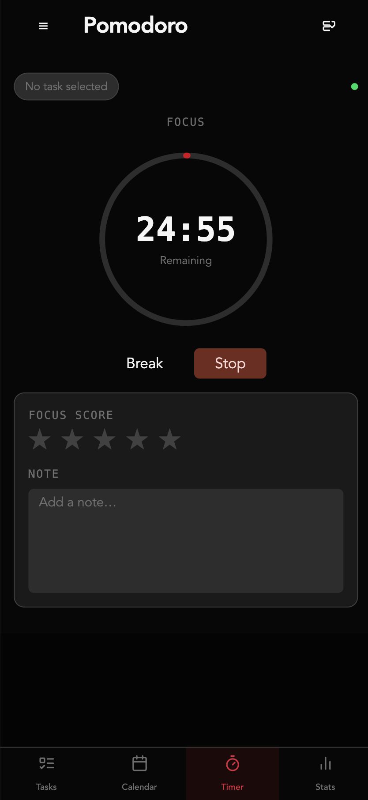

# FocusFlow

[](LICENSE)
[](https://github.com/francesco-gaglione/focus_flow_cloud/actions)
[](https://github.com/francesco-gaglione/focus_flow_cloud/actions)
[](https://francesco-gaglione.github.io/focus_flow_cloud/)
[](https://buymeacoffee.com/francescogaglione)
[](https://codecov.io/gh/francesco-gaglione/focus_flow_cloud)

A comprehensive Pomodoro technique tracking solution featuring a Rust backend and a native cross-platform app built with Tauri v2 + SvelteKit. This monorepo contains both the cloud infrastructure and the client application.

> **Full Documentation**: [https://francesco-gaglione.github.io/focus_flow_cloud/](https://francesco-gaglione.github.io/focus_flow_cloud/)

## Screenshots

<table>
  <tr>
    <td align="center"><b>Tasks</b></td>
    <td align="center"><b>Calendar (Month)</b></td>
    <td align="center"><b>Calendar (Week)</b></td>
    <td align="center"><b>Statistics</b></td>
    <td align="center"><b>Timer</b></td>
  </tr>
  <tr>
    <td></td>
    <td></td>
    <td></td>
    <td></td>
    <td></td>
  </tr>
</table>

## What is FocusFlow?

FocusFlow is a complete ecosystem for time management using the Pomodoro technique. It allows you to:

- **Track Sessions**: Manage work and break intervals.
- **Sync in Real-time**: Synchronize state across multiple devices using WebSockets.
- **Organize Tasks**: Categorize, prioritize, and schedule your to-dos.
- **Analyze Productivity**: View detailed statistics and patterns.
- **Native Experience**: Download and install the native app on macOS, Windows, Linux, and Android.

I built this project for my personal use to optimize my daily workflow and decided to share it as an open-source project.

## Project Structure

This is a monorepo containing:

- **[`backend/`](backend/)**: Server-side application built with Rust (Axum, Diesel, Tokio).
- **[`app/`](app/)**: Native cross-platform app built with Tauri v2 + SvelteKit + TypeScript.

## Features

### Backend

- **Pomodoro Session Tracking**: Core logic for timer state.
- **Real-time Synchronization**: WebSocket broadcasting to all connected clients.
- **RESTful API**: Documented via OpenAPI/Swagger.
- **Clean Architecture**: Domain-driven design.
- **Push Notifications**: Reminder delivery via Web Push (VAPID).

### App

- **Timer UI**: Clean, responsive interface for managing focus sessions.
- **Task Management**: Create, edit, prioritize, and schedule tasks with category support.
- **Calendar**: Month and week views with time-positioned task blocks colored by priority.
- **Statistics**: Visual insights into your productivity (sessions, tasks by priority/category, overdue trend, peak hours).
- **Native Notifications**: System-level notifications for Pomodoro transitions and reminders.
- **Cross-platform**: macOS, Windows, Linux, Android — download from [Releases](https://github.com/francesco-gaglione/focus_flow_cloud/releases).
- **Self-hosted friendly**: On first launch, enter your backend URL — no config files needed.

## Downloading the App

Pre-built binaries are available on the [GitHub Releases](https://github.com/francesco-gaglione/focus_flow_cloud/releases) page:

| Platform | File |
| :--- | :--- |
| macOS (Apple Silicon) | `.dmg` |
| macOS (Intel) | `.dmg` |
| Linux | `.deb` / `.AppImage` |
| Windows | `.exe` / `.msi` |
| Android | `.apk` |

On first launch, enter your backend server URL to connect.

## Getting Started

### Self-Hosting with Docker

The easiest way to run FocusFlow is using Docker Compose.

PLEASE READ THE [FULL DOCUMENTATION](doc/docs/getting-started.md) for detailed setup instructions.

**Quick Example (`docker-compose.yml`):**

```yaml
services:
  backend:
    image: ghcr.io/francesco-gaglione/focusflowcloud:latest
    environment:
      - DATABASE_BASE_URL=db:5432
      - POSTGRES_USER=focusflow
      - POSTGRES_PASSWORD=secure_pw
      - POSTGRES_DB=focusflow
      - JWT_SECRET=change_me
      - CORS_ORIGIN=*
      - VAPID_PRIVATE_KEY=your_vapid_private_key
    ports: ["8080:8080"]
    depends_on: [db]
  db:
    image: postgres:15-alpine
    environment:
      - POSTGRES_USER=focusflow
      - POSTGRES_PASSWORD=secure_pw
      - POSTGRES_DB=focusflow
```

After starting the backend, download the app from [Releases](https://github.com/francesco-gaglione/focus_flow_cloud/releases), install it, and enter your server URL on first launch.

### Self-Hosting with Kubernetes

Kubernetes manifests are provided in the [`k8s/`](k8s/) directory. The namespace must be applied first, then the rest in dependency order:

```bash
cd k8s
kubectl apply -f namespace.yaml
kubectl apply -f postgres-secret.yaml
kubectl apply -f postgres-config.yaml
kubectl apply -f postgres-volume.yaml
kubectl apply -f postgres.yaml
kubectl apply -f focus-flow-cloud-secret.yaml
kubectl apply -f focus-flow-cloud-config.yaml
kubectl apply -f focus-flow-cloud.yaml
```

### Development Setup

We use [`just`](https://github.com/casey/just) to manage commands for the entire repository.

**Prerequisites**: Rust 1.77+, [Bun](https://bun.sh/), Docker, [Tauri prerequisites](https://tauri.app/start/prerequisites/) for your platform.

**Quick Commands**:

| Command | Description |
| :--- | :--- |
| `just backend-run` | Run the Rust backend locally |
| `just app-dev` | Start the SvelteKit dev server |
| `just app-tauri-dev` | Run the full Tauri desktop app in dev mode |
| `just test-all` | Run all tests |

#### 1. Setup Backend (Local)

1. **Environment**: `backend/.env` is required. See `.env.example`.
2. **Database**:
   ```bash
   cd backend && docker-compose up -d db
   diesel migration run
   ```
3. **Run**: `just backend-run`

#### 2. Setup App (Local)

```bash
cd app
bun install
bun run tauri:dev   # launches Tauri desktop app with hot-reload
```

On first launch, enter `http://localhost:8080` as the server URL.

## Contributing

Contributions are welcome! This monorepo allows you to work on the full stack.

- If you change the API, update the app client accordingly.
- Run `just test-all` before submitting a PR.

### Commit Guidelines

We strictly follow **[Conventional Commits](https://www.conventionalcommits.org/)** to manage versioning and changelogs automatically.

**Format:**

```text
<type>(<scope>): <subject>
```

**Common Types:**

- `feat`: A new feature (**Minor** version bump)
- `fix`: A bug fix (**Patch** version bump)
- `docs`, `chore`, `refactor`, `test`: Other changes (no version bump)

> [!IMPORTANT]
> **Breaking Changes**
> If your changes break backward compatibility, you **MUST** indicate it to trigger a **MAJOR** version bump.
>
> You can do this by adding a `!` after the type:
>
> ```text
> feat!: remove legacy API endpoints
> ```

## License

This project is licensed under the MIT License - see the [LICENSE](LICENSE) file for details.
