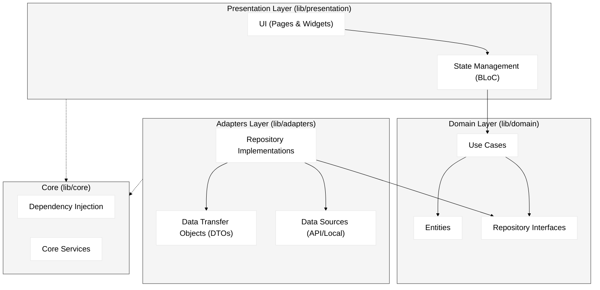

# App Architecture

The FocusFlow mobile application is built with **Flutter** and strictly adheres to **Clean Architecture** principles to ensure scalability, testability, and separation of concerns.

## 🏗️ Architectural Overview

The app is divided into three main layers, with an additional Core module for cross-cutting concerns. Dependencies flow **inwards** towards the Domain layer.

## 📦 Layer Breakdown

### 1. Domain Layer (`lib/domain`)
The heart of the application. It contains the business logic and is independent of Flutter, UI, or data sources.
- **Entities**: Pure Dart classes representing business objects (e.g., `FocusSession`).
- **Use Cases**: Encapsulate specific business rules (e.g., `StartSessionUseCase`).
- **Repository Interfaces**: Abstract contracts defining data operations.

### 2. Presentation Layer (`lib/presentation`)
Responsible for the UI and state management.
- **BLoC (Business Logic Component)**: Manages state using standard `flutter_bloc`. It receives **Events** from the UI and emits **States**.
- **Pages & Widgets**: Dumb components that render the state provided by BLoCs.

### 3. Adapters Layer (`lib/adapters`)
Handles data retrieval and transformation.
- **Repository Implementations**: Concrete classes that implement Domain interfaces.
- **DTOs**: Data Transfer Objects for JSON serialization/deserialization.
- **Data Sources**: APIs (Dio) or local storage (Isar/Hive).

### 4. Core (`lib/core`)
Common utilities and configuration.
- **Dependency Injection**: `get_it` and `injectable` for wiring.
- **Services**: Navigation, Theme, Localization.

## 🔄 State Management (BLoC)

We use the **BLoC** pattern to separate business logic from UI.

1.  **Event**: UI sends an event (e.g., `StartSessionPressed`).
2.  **BLoC**: Handles the event, executes a Use Case.
3.  **State**: BLoC yields a new state (e.g., `SessionLoading` -> `SessionStarted`).
4.  **UI**: Rebuilds based on the new state.
