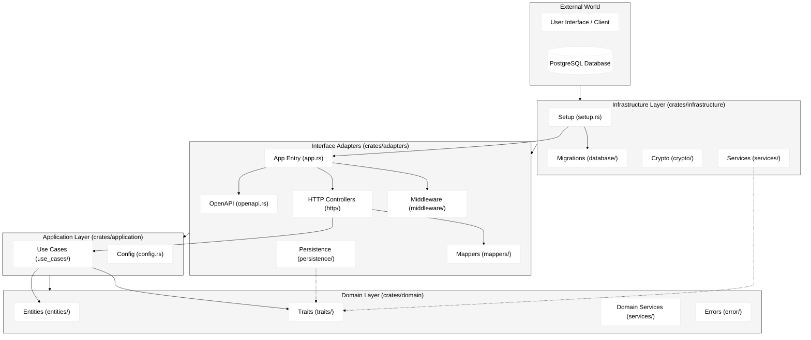

# Backend Architecture

FocusFlow's backend is built using **Clean Architecture** principles to ensure separation of concerns, testability, and independence from external frameworks.

## 🏗️ High-Level Overview

The system is organized into four concentric layers, with dependencies flowing **inwards**. The inner layers know nothing about the outer layers.

## 📦 Workspace Structure
    
The backend is a Rust workspace organized into four main crates, strictly following the Clean Architecture dependency rule:

### 1. `crates/domain` (The Core)
- **Responsibility**: Contains the enterprise business rules and pure logic. It is stable and independent of frameworks.
- **Dependencies**: None.
- **Contents**:
    - **Entities**: Mutable business objects (e.g., `FocusSession`, `Task`, `User`).
    - **Traits**: Interfaces (Ports) for repositories and services (defined here, implemented outer).
    - **Services**: Domain services for logic that doesn't fit into a single entity.
    - **Errors**: Domain-specific error definitions.

### 2. `crates/application` (The Orchestration)
- **Responsibility**: Application-specific business rules. It implements the "Use Cases" of the system.
- **Dependencies**: `domain`.
- **Contents**:
    - **Use Cases**: Interactors that orchestrate the flow of data using domain entities and repository traits (e.g., `StartSession`, `CreateTask`).
    - **Config**: Application configuration logic.

### 3. `crates/adapters` (The Interface)
- **Responsibility**: Converts data between the format most convenient for use cases/entities and the format convenient for external agencies (Web, DB).
- **Dependencies**: `application`, `domain`.
- **Contents**:
    - **App Entry**: `app.rs` initializes the application wiring.
    - **Http**: Controllers/Handlers for the REST API.
    - **OpenAPI**: API documentation definitions (`openapi.rs`).
    - **Persistence**: Concrete implementation of repository traits (adapting to Diesel/SQL).
    - **Mappers**: Translation between DTOs and Domain Entities.
    - **Middleware**: Authentication and other cross-cutting concerns.

### 4. `crates/infrastructure` (The Plumbing)
- **Responsibility**: Contains details about frameworks, drivers, and external tools. The outermost layer.
- **Dependencies**: `adapters`, `application`, `domain` (for setup and wiring).
- **Contents**:
    - **Setup**: `setup.rs` bootstraps the database pool and other infrastructure.
    - **Database**: Database migrations and connection logic.
    - **Services**: Implementations of external services (e.g., Crypto, Third-party APIs).

## Swagger

API documentation for the backend is available at `/swagger-ui`.
