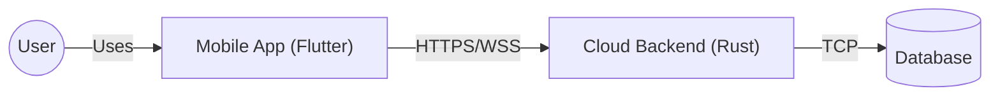

# Architecture Overview

FocusFlow is a comprehensive system composed of two main parts:

1.  **Cloud Backend**: A robust, scalable server built with Rust, following Clean Architecture principles. It handles business logic, data persistence, and synchronization.
2.  **Mobile App**: A cross-platform application built with Flutter, providing the user interface and local functionality.

The two components communicate via a secure REST API and real-time WebSockets.

## System Context

Choose a section to dive deeper:
- **[Backend Architecture](./backend)**: Internal structure of the Rust server.
- **[App Architecture](./app)**: Overview of the Flutter application.
