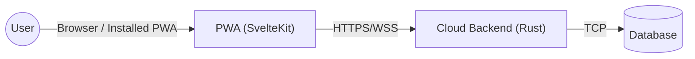

# Architecture Overview

FocusFlow is a comprehensive system composed of two main parts:

1.  **Cloud Backend**: A robust, scalable server built with Rust, following Clean Architecture principles. It handles business logic, data persistence, and synchronization.
2.  **PWA**: A Progressive Web App built with SvelteKit (TypeScript), providing the user interface and installable experience on any platform.

The two components communicate via a secure REST API and real-time WebSockets.

## System Context

```mermaid
graph LR
    User((User))
    PWA["PWA (SvelteKit)"]
    Back["Cloud Backend (Rust)"]
    DB[(Database)]

    User -- Browser / Installed PWA --> PWA
    PWA -- HTTPS/WSS --> Back
    Back -- TCP --> DB
```
