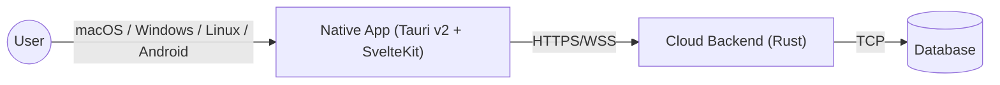

# Architecture Overview

FocusFlow is a comprehensive system composed of two main parts:

1. **Cloud Backend**: A robust, scalable server built with Rust, following Clean Architecture principles. It handles business logic, data persistence, and synchronization.
2. **Native App**: A cross-platform desktop and mobile application built with Tauri v2 (Rust) + SvelteKit (TypeScript), providing a native experience on macOS, Windows, Linux, and Android.

The two components communicate via a secure REST API and real-time WebSockets.

## System Context

```mermaid
graph LR
    User((User))
    App["Native App (Tauri v2 + SvelteKit)"]
    Back["Cloud Backend (Rust)"]
    DB[(Database)]

    User -- macOS / Windows / Linux / Android --> App
    App -- HTTPS/WSS --> Back
    Back -- TCP --> DB
```
